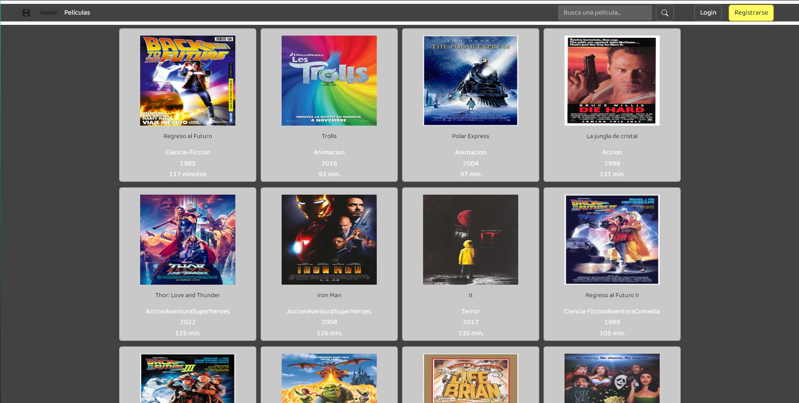
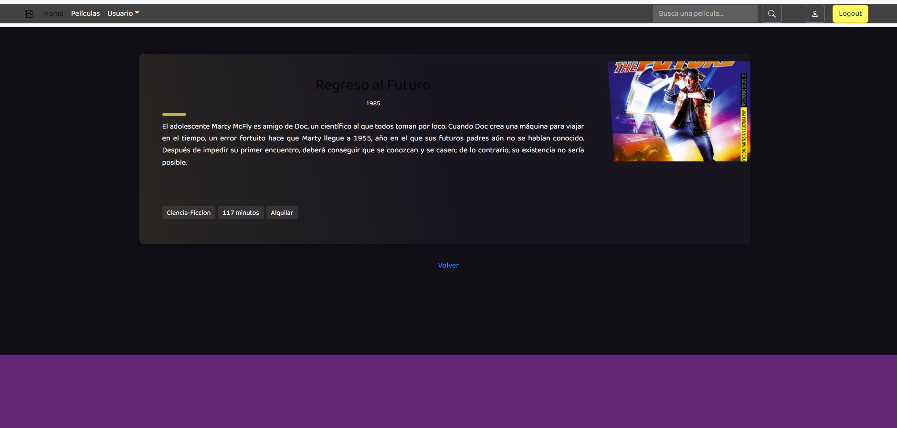
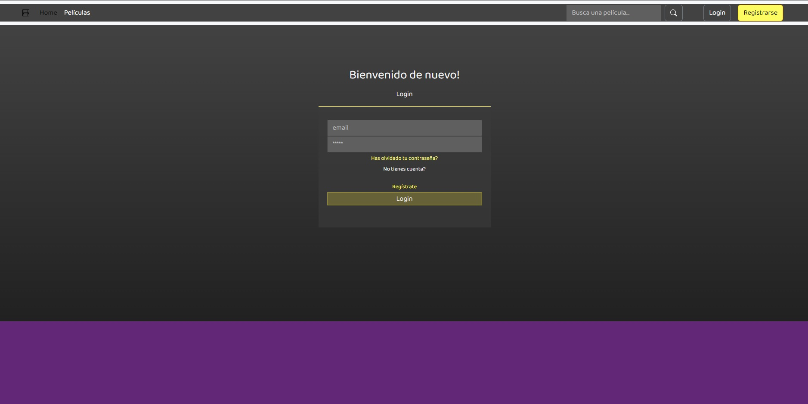
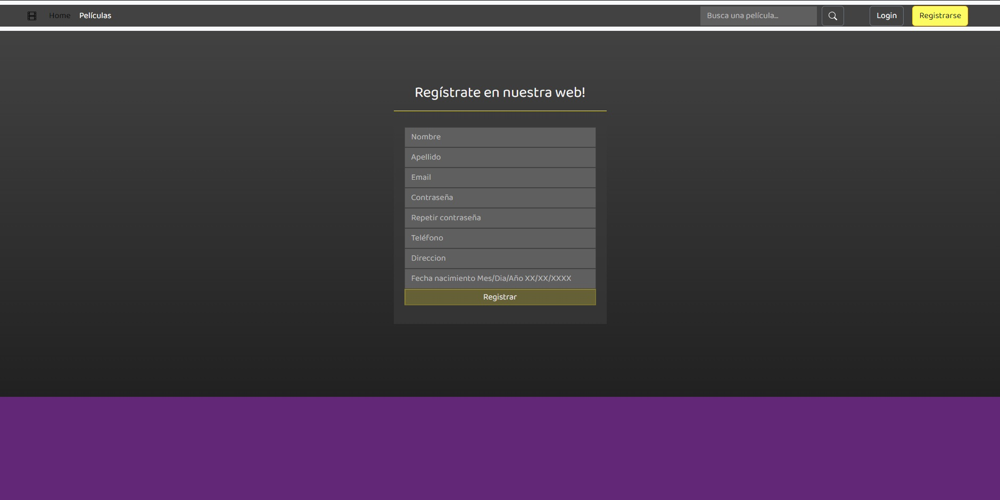

# Front-End Videoclub
---
Para este proyecto se nos pidió que crearamos una página web con la base de datos que previamente hicimos. 

---
## Trabajo Realizado 🔧
---

Lo primero que hicimos fue juntarnos y crear en Trello las tablas y las diferentes tareas a realizar. Una vez tuvimos claro el
proceso a seguir, nos fuimos repartiendo las diferentes tareas.

_Foto de Ejemplo_

Lo primero que hicimos fue la vista Home. Utilizamos una barra de navegacion para los botones de login y register. Así mismo, tambien implementamos la barra de búsqueda, como se puede apreciar en la imagen a continuacion

_Foto de Ejemplo_

Tambien creamos una vista detallada de las películas. En la cual se puede leer la sinopsis y (si estas registrado) poder alquilar la película

_Foto de Ejemplo_

Después hicimos la vista Login.

_Foto de Ejemplo_

A continuacion lo siguiente fue el formulario de registro

_Foto de Ejemplo_

Decidimos hacer un par de vistas mas como una para el Admin. Para poder buscar los pedidos y los usuarios etc. Y tambien el perfil. Y con eso terminamos el proyecto.

---

<h4>Herramientas 🛠️</h4>

---

- JavaScript

- React/Redux

- Postman

- Heroku

---

<h4>Diseño y Producido ✒️</h4>

---

Iván Bara Lorenzo

Lionel M. Garcia Bustos